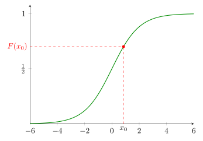
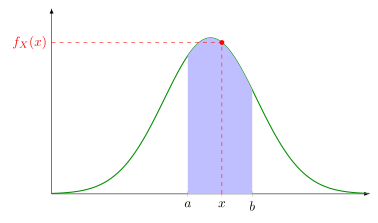

# Probability Spaces

Probability theory is built on the foundation of measure theory, which provides a powerful generalization of "length" / "area" that is compatible with our intuition of what "should" happen for basic set operations. Usually the underlying representation is kept purely abstract! We can always provide some specific concrete representation if we need to, but we rarely need to, because we are (usually) only interested in the abstract properties they are guaranteed to have regardless of concrete representation.

**Def:** A **probability space** $`(\Omega, \mathcal{F}, P)`$ has three defining components:

- the **sample space** $`\Omega`$: any nonempty set, the set of possibilities/outcomes.

- a **$`\sigma`$-algebra** $`\mathcal{F} \subseteq \mathcal{P}(\Omega)`$: a family of subsets of $`\Omega`$ satisfying

```math
\begin{aligned}
&\text{i)} \quad \Omega \in \mathcal{F} &&\text{contains the whole sample space} \\
&\text{ii)} \quad A \in \mathcal{F} \rightarrow A^c \in \mathcal{F} &&\text{closed under complement} \\
&\text{iii)} \quad \{A_n\}_{n=1}^{\infty} \subset \mathcal{F} \rightarrow \bigcup_{n=1}^{\infty} A_n \in \mathcal{F} &&\text{closed under countable unions}
\end{aligned}
```

- the **probability measure** $`P \colon \mathcal{F} \to [0,1]`$: a measure with the property that $`P(\Omega) = 1`$.

### Why all this technical machinery?

Why all this technical machinery? Because it turns out we can't meaningfully define a reasonable notion of "length" / "area" for _arbitrary_ subsets.

> **Banach–Tarski:** For any arbitrary bounded $`U`$ and $`V`$, there is a partition of $`U`$ into finite disjoint $`\{E_n\}_{n=1}^N`$ s.t. rigid rotations and translations of $`\{E_n\}`$ union to $`V`$.

Rigid motions of disjoint unions do not preserve volume. Our only hope is to restrict ourselves to some family of subsets for which we can define a meaningful measure. These formalisms do exactly that.


## Significance of Measures

Most of the technical axioms of a probability space belong to all measures. To define a measure $`\mu`$ on subsets of some space $`\Omega`$:

1. Choose a suitable "generating set" on which $`\mu`$ is simple to define.

2. Iteratively extend $`\mu`$ to set complements and countable unions of sets in the generating family. This extension is unique.

3. The generating set generates a $`\sigma`$-algebra $`\mathcal{F}`$ of measurable sets that can be measured by (the extension of) $`\mu`$.


### Example for $`\mathbb{R} = \Omega`$: Borel Sets and Borel Measure

Our generating set is the open intervals. Let $`\mu((a,b)) = b - a`$ on finite open intervals. The open intervals generate the *Borel sets* $`\mathcal{B}`$ and the *Borel measure* $`\mu = \beta`$.

$`\mathcal{B}`$ is also generated by
- $`\{(-\infty, a) \mid a \in \mathbb{R}\}`$
- $`\{(a,\infty) \mid a \in \mathbb{R}\}`$
- $`\{(-\infty, a] \mid a \in \mathbb{R}\}`$
- $`\{[a,\infty) \mid a \in \mathbb{R}\}`$
- etc.

**Note:** The measure space $`(\mathbb{R}, \mathcal{B}, \beta)`$ can be extended to an even larger class of Lebesgue-measurable sets. We rarely need this added sophistication.

---


This machinery allows us to prove things about $`\mu`$ by proving them for $`\mu`$ restricted to the generating set and getting it for all of $`\mathcal{F}`$ "for free." This is why we use $`P(a < X \leq b)`$ or the CDF $`P(X \leq a)`$.

This same machinery is how integration is rigorously defined. Thus, definitions like

```math
F_X(x) := P(X \leq x) = \int_{-\infty}^{x} f_X(\omega) \, d\omega
```

are consistent with the measure theoretic definition.

## Random Variables

As promised, we almost immediately abandon particular concrete representations for the objects $`\Omega`$, $`\mathcal{F}`$, and $`P`$ that define a particular probability space, because their utility lies in their universal abstract properties.

Recall our mental model: $`\Omega`$ is the set of all possible universes or outcomes, and $`\omega \in \Omega`$ is a particular universe that "might happen."

A random variable $`X`$ is just a function $`X : \Omega \to \mathbb{R}`$ that picks out which real-valued feature of the universe you care about. Different choices of $`X`$ on the same $`(\Omega, \mathcal{F}, P)`$ are different measurements (answering different questions) of one shared source of randomness.

The r.v. $`X : \Omega \to \mathbb{R}`$ is what enables us to "not care" about having a particular concrete representation for $`(\Omega, \mathcal{F}, P)`$ (even though we could always construct one if required): instead of working with the abstract probability space $`(\Omega, \mathcal{F}, P)`$, we work with the concrete probability space $`(\mathbb{R}, \mathcal{B}, P_X)`$.

**Def:** The *distribution of a random variable* $`X : \Omega \to \mathbb{R}`$ is
```math
P_X := P \circ X^{-1},
```
which is a probability measure for the probability space $`(\mathbb{R}, \mathcal{B}, P_X)`$.

($`P_X`$ is called the *pushforward measure* in measure theory.)

**Recall:** $`\mathcal{B}`$ is the set of Borel subsets of $`\mathbb{R}`$, which is the $`\sigma`$-algebra generated by open intervals $`(a,b)`$, or generated by half-lines $`(-\infty, a)`$.

**Technical requirement:** We need all of this to be compatible with the measure theory machinery, so we require $`X : \Omega \to \mathbb{R}`$ to be a *measurable function*, that is $`X^{-1}(A) \in \mathcal{F}`$ for any $`A \in \mathcal{B}`$. But recall that this is true if and only if $`X^{-1}((a,b)) \in \mathcal{F}`$ for every finite interval, which is true if and only if $`X^{-1}((-\infty, a)) \in \mathcal{F}`$ for every "half-line" $`(-\infty, a) \subset \mathbb{R}`$.

All the "downstream" theory just depends on $`P_X`$.

**Terminology:** $`P_X`$ is sometimes called the "law" of $`X`$.

## Notation

| Common Notation | Measure-theoretic Meaning | English Interpretation |
|---|---|---|
| $`P(X \in A)`$ | $`P_X(A) = P(X^{-1}(A))`$ <br> $`= P(\{\omega \mid X(\omega) \in A\})`$ | "The probability that X takes a value in A." |
| $`P(X \leq x)`$ | $`P_X((-\infty, x]) = P(X^{-1}((-\infty, x]))`$ <br> $`= P(\{\omega \mid X(\omega) \leq x\})`$ | "...X is at most x." |
| $`P(X = x)`$ | $`P_X(\{x\}) = P(X^{-1}(\{x\}))`$ <br> $`= P(\{\omega \mid X(\omega) = x\})`$ | "...X is exactly equal to x." |
| $`P(a < X < b)`$ | $`P_X((a,b)) = P(X^{-1}((a,b)))`$ <br> $`= P(\{\omega \mid X(\omega) \in (a,b)\})`$ | "...X takes a value in the open interval (a,b)." |

## Cumulative Distribution Function

The "top-down" measure-theoretic construction makes the cumulative distribution function a very natural object to study.

**Def:** The *cumulative distribution function (CDF)* of an r.v. $`X : \Omega \to \mathbb{R}`$ is the function $`F_X : \mathbb{R} \to [0,1]`$ defined by
```math
F_X(x) := P_X((-\infty, x]) = P(X \leq x).
```

**Note:** The family $`\{(-\infty, x] \mid x \in \mathbb{R}\}`$ is a generating set for $`\mathcal{B}`$, the Borel sets. The machinery of measure theory guarantees that if you know $`P_X`$ on the generating set, then $`P_X`$ is completely (uniquely) determined. Therefore, $`F_X \leftrightarrow P_X`$ is a perfect two-way correspondence!

**Notation:** We drop the name of the r.v. in the subscript when it is clear from context: $`F(x) := P(X \leq x)`$.

**Convention:** Defining $`F_X(x) := P(X \leq x)`$ makes $`F_X`$ right-continuous, while the alternative definition $`F_X(x) := P(X < x)`$ makes it left-continuous. If $`F_X`$ is continuous, these definitions coincide, and $`P(X = x) = 0`$.

**Def:** The *survival function* of an r.v. $`X : \Omega \to \mathbb{R}`$ is the function $`S_X : \mathbb{R} \to [0,1]`$ defined by $`S_X(x) = 1 - F_X(x) = P(X > x)`$.



The CDF $`F_X`$ satisfies

- $`\displaystyle\lim_{x \to -\infty} F_X(x) = 0`$

- $`\displaystyle\lim_{x \to \infty} F_X(x) = 1`$

- is right-continuous (by convention): $`\displaystyle\lim_{x \to c^+} F_X(x) = F_X(c)`$.

- $`F_X(x)`$ is non-decreasing.

- "The probability that X is at most x is $`F_X(x)`$."

- "The probability that X exceeds x is $`S_X(x)`$."

**Terminology:** Some authors call $`F_X`$ the distribution of $`X`$. The map $`P_X \leftrightarrow F_X`$ is a bijection, and so "the distribution of $`X`$" is well-defined regardless of which representative someone has in mind.

## A Theorem About the CDF: The Probability Integral Transform

For an r.v. $`X`$ with continuous distribution $`F_X`$, the r.v. defined by $`U := F_X(X)`$ can be interpreted as giving the *percentile rank* of the outcome. The map $`F_X`$ in a sense "flattens out" $`X`$. The r.v. $`U`$ is guaranteed to be uniformly distributed on $`(0,1)`$.

**Theorem (The Probability Integral Transform).**
Let $`X`$ be an r.v. with continuous cumulative distribution $`F_X`$. Then the r.v. $`U := F_X(X)`$ is uniformly distributed on $`(0,1)`$.

**Proof.** Let $`u \in (0,1)`$. We seek to show that $`P(F_X(X) \le u) = u`$.

Let $`x_u := \inf\{x : F_X(x) \ge u\}`$. By continuity of $`F_X`$, we have $`F_X(x_u) = u`$. Since $`F_X`$ is nondecreasing, $`a \le b \implies F_X(a) \le F_X(b)`$, and so
```math
\{X \le x_u\} \subset \{F_X(X) \le u\}.
```
Thus, $`P(X \le x_u) \le P(F_X(X) \le u)`$. However, these sets may not be equal (if $`F_X`$ is not strictly increasing). In particular, the following set may be nonempty:
```math
D := \{x : x_u < x \text{ and } F_X(x) = u = F_X(x_u)\} = \{F_X(X) \le u\} \setminus \{X \le x_u\}.
```

**Claim.** $`D`$ is either empty or an interval of the form $`(x_u, c]`$.

*Proof of Claim.* Suppose $`a, c \in D`$ with $`a \le c`$, and suppose $`b`$ is some point with $`a \le b \le c`$. Since $`F_X`$ is nondecreasing, $`F_X(a) \le F_X(b) \le F_X(c)`$. By assumption, $`x_u < a \implies x_u < b`$. Also, $`F_X(a) = F_X(c) = u \implies F_X(b) = u`$. This shows that if $`d \in D`$, then $`(x_u, d) \subset D`$. Let $`c := \sup\{x : x \in D\}`$. By continuity of $`F_X`$, $`c \in D`$. Thus, $`D = (x_u, c]`$. $`\quad\square`$

If $`D`$ is empty, $`P(D) = 0`$. Otherwise,
```math
P(D) = P((x_u, c]) = F_X(c) - F_X(x_u) = u - u = 0.
```
In either case, $`D`$ is a $`P`$-null set.

We have shown that
```math
\begin{aligned}
P(F_X(X) \le u) &= P\big(\{F_X(X) \le u\} \cap \{X \le x_u\} \;\cup\; \{F_X(X) \le u\} \setminus \{X \le x_u\}\big) \\
&= P(X \le x_u) + P(D) \\
&= u + 0 \\
&= u. \quad\blacksquare
\end{aligned}
```

**Interpetation:** Every continuous random variable, no matter how lumpy or skewed its distribution, is *the uniform distribution in disguise* — and $`F_X`$ is the disguise. Applying $`F_X`$ to $`X`$ strips away all the distributional shape and leaves behind featureless uniform randomness on $`(0,1)`$. So the theorem says, *the only thing that distinguishes one continuous random variable from another is the coordinate system*, i.e. the function $`F_X`$ used to read it off. Underneath, they are all the same object — a $`\text{Uniform}(0,1)`$ — viewed through different monotone lenses.

## Probability Density Function

We can "construct" a CDF "from the bottom-up" using a probability density function, and then talk about random variables having such a CDF (or associated distribution $`P_X`$).

**Def:** A function $`f_X : \mathbb{R} \to [0,\infty)`$ is a *probability density function (PDF)* for an r.v. $`X : \Omega \to \mathbb{R}`$ (resp. for the CDF $`F_X`$) if
```math
F_X(x) = \int_{-\infty}^x f_X(w)\,dw.
```

**Minor technicalities:**
- $`f_X`$ must be measurable for this to make sense.
- $`f_X`$ is only unique up to a set of measure zero. We could redefine $`f_X`$ at a single point with no effect, for example.

The *Fundamental Theorem of Calculus* guarantees that $`F_X' = f_X`$. What's more, because $`F_X`$ is monotone, $`F_X'`$ is guaranteed to exist almost everywhere (outside of a set of measure zero). Therefore, it is tempting to define the PDF "from the top-down" as $`f_X := F_X'`$. Alas, $`F_X'`$ is not guaranteed to recover $`F_X`$ in the general case!

**Def:** $`F_X`$ is *absolutely continuous* if
```math
F_X(x) = \int_{-\infty}^x F_X'(w)\,dw.
```
The function $`f := F_X'`$ is called the *probability density function (PDF)* for $`F_X`$ (resp. for $`X`$, $`P_X`$).

Almost any distribution you are likely to encounter in practice will have a PDF. As with non-measurable sets and non-measurable functions, this is mostly a technicality.

The probability density function describes how likelihood is "spread out" over a space. As such, it describes the relative probability that an r.v. will take a value.

Because $`P(X = x) = 0`$ for continuously distributed $`X`$, it's usually more useful to talk about $`X`$ taking a value in an interval:
```math
P(a < X \leq b) = \int_a^b f_X(x)\,dx \overset{\text{F.T.C.}}{=} F_X(b) - F_X(a).
```
```math
= \int_{-\infty}^b f(x)\,dx - \int_{-\infty}^a f(x)\,dx
```



## (Re)Connect to Freshman Calculus

Recall our cast of characters:

- The **cumulative distribution function (CDF)** $`F_X : \mathbb{R} \to [0,1]`$,
  
  $`\displaystyle F_X(x) := P(X \le x) = \int_{-\infty}^x f_X(w)\,dw.`$
  
  The probability that…
    - ...$`X`$ is at most $`x`$.
    - ...event happens on or before $`x`$.

- The **probability density function (PDF)** $`f_X : \mathbb{R} \to [0,\infty)`$,
  
  $`\displaystyle f_X = F_X', \qquad F_X(x) = \int_{-\infty}^x f_X(w)\,dw, \qquad f_X(x) = \lim_{h\to 0^+} \frac{P_X([x,x+h])}{h}.`$

  - The local probability per unit length.
  - How the likelihood of values of $`X`$ are "spread out" over $`\mathbb{R}`$.


```math
P(x < X \le x+h) = \int_x^{x+h} f(w)\,dw = F(x+h) - F(x)
```

This integral is the area under the graph of $`f`$. It is approximated (badly) by the rectangle:
```math
P(x < X \le x+h) \approx \underbrace{h}_{\text{width}} \cdot \underbrace{f(x)}_{\text{height}}
```
or
```math
f(x) \approx \frac{P(x < X \le x+h)}{h}.
```

The approximation gets better and better as we shrink the width of the rectangle:
```math
f(x) \;\overset{\text{exact!}}{=}\; \lim_{h \to 0^+} \frac{P(x < X \le x+h)}{h} = \lim_{h \to 0^+} \frac{F(x+h) - F(x)}{h} = F'(x).
```

The expression $`\dfrac{P(x < X \le x+h)}{h}`$ gives the "probability per unit length for points near $`x`$."

Another interpretation: $`P(x < X \le x)`$ is the fraction (percentage) of total population for which $`X`$ falls within the interval $`(x, x+h]`$.

So if $`X`$ is, say, a wait time (time to failure, lifetime, etc.), then
```math
f(x) \approx \frac{P(x < X \le x+h)}{h}
```
is a rate, namely the "percentage of total population per unit time."

## Survival Function and Hazard Rate

If $`X`$ is an r.v. representing lifetime, wait time, "time till event," "time to failure," or similar, the survival function is especially useful.

**Def:** The *survival function* of an r.v. $`X : \Omega \to \mathbb{R}`$ is the function $`S_X : \mathbb{R} \to [0,1]`$ defined by
```math
S_X(x) := 1 - F_X(x) = P(X > x) = \int_x^\infty f_X(w)\,dw.
```

**Interpretation:** "$`S_X(x)`$ is the probability that…"
- "…the component still functions after time $`x`$."
- "…the organism is still alive after time $`x`$."
- "…$`X`$ exceeds the level $`x`$."
- "…the event takes longer than $`x`$ to occur."

**Note:** For lifetime or wait time contexts, we often have $`X \ge 0`$. Consequently, both $`f_X`$ and $`F_X`$ are both zero for $`x < 0`$. So we often write
```math
F(x) = \int_0^x f(w)\,dw, \qquad \text{(notice the lower bound in the integral)}
```
where $`x \ge 0`$ is understood from context.

Suppose $`X \ge 0`$ represents time to failure (of a mechanical component, say). Recall that
```math
f(x) = \lim_{h \to 0^+} \frac{P(x < X \le x+h)}{h}
```
can be interpreted as the (unconditional) *instantaneous probability of failure per unit time* at time $`x`$, as measured against the entire original population (set of all possible outcomes).

But what we often want instead is the instantaneous probability of failure per unit time *among those still alive at time* $`x`$, which is a conditional probability.

**Def:** The *hazard* (*hazard function*, *hazard rate*) for an r.v. $`X`$ is the function $`h_X : \mathbb{R} \to [0,\infty)`$ defined by
```math
\begin{align*}
h_X(x) &= \lim_{h\to 0^+} \frac{1}{h} \cdot P(x < X \le x+h \mid X > x) \\
       &= \lim_{h \to 0^+} \frac{1}{h}\cdot\frac{P(x < X \le x+h)}{P(X > x)} \\
       &= \frac{f_X(x)}{S_X(x)}.
\end{align*}
```

**Interpretation:** $`h_X(x)`$ is the instantaneous rate of failure at time $`x`$ for an individual that has survived until $`x`$.

## Cumulative Hazard Function

The cumulative hazard function $`H_X`$ for the (regular) hazard function $`h_X`$ is analogous to how the cumulative density function $`F_X`$ is related to the probability density function $`f_X`$.

**Def:** The *cumulative hazard function* for an r.v. $`X : \Omega \to \mathbb{R}`$ is the function $`H_X : \mathbb{R} \to [0,\infty)`$ defined by
```math
H_X(x) = \int_{-\infty}^x h_X(w)\,dw,
```
where $`h_X`$ is the hazard function $`h_X := \frac{f_X}{S_X} = \frac{f_X}{1 - F_X}.`$


**Interpretation:** The value $`H_X(x)`$ is…
- …the expected number of failures by time $`x`$ (assuming instant re-fail-ability).
- …the expected number of events you would accrue given the rate function $`h_X`$.
- …the running total (accumulated) risk exposure an individual has experienced/been exposed to by the time it reaches $`x`$.

**Note:** If $`X \ge 0`$, as is often the case for time-till-event, then we can set the lower limit to be $`0`$ whenever $`x \ge 0`$:
```math
H_X(x) = \int_0^x h_X(w)\,dw \qquad (x \ge 0).
```


## Relationships Between PDF, CDF, Survival, Hazard, and Cumulative Hazard

Recall that $`f = F'`$ and $`S := 1 - F`$. Thus, $`F = 1 - S`$, and $`F' = -S'`$. Therefore,
```math
h := \frac{f}{S} = \frac{F'}{S} = -\frac{S'}{S}, \qquad \text{and}
```
```math
H(x) = \int_{-\infty}^x \frac{-S'(w)}{S(w)}\,dw = -\log S(x) \quad\longleftrightarrow\quad S(x) = e^{-H(x)}.
```

Observe that the survival $`S(x) := P(x < X) \xrightarrow{x\to\infty} 0`$. Therefore,
```math
\lim_{x\to\infty} H(x) = \lim_{x\to\infty} -\log S(x) = \infty.
```

**Akshually:** $`H_X`$ can be defined for any $`F_X`$, even when $`f_X`$ doesn't exist, and thus $`h_X`$ doesn't exist, but it requires a more technical and sophisticated definition. It turns out the condition on $`H_X`$ for $`h_X`$ to exist is the same one needed on $`F_X`$ for $`f_X`$ to exist. In fact:

> $`H_X(x) = \int_{-\infty}^x h_X(w)\,dw`$ if and only if $`H_X`$ is absolutely continuous if and only if $`F_X`$ is absolutely continuous if and only if $`F_X(x) = \int_{-\infty}^x f_X(w)\,dw`$.


## Time-Rescaling by the Cumulative Hazard

It turns out that $`H_X`$ is the transformation that turns any lifetime into a standard one: if you rescale time by the cumulative hazard, the (rescaled) event happens at a rate 1 exponential.

**Theorem:** Let $`F_X`$ be a continuous CDF for an r.v. $`X`$. Then the r.v. $`Y := H_X(X)`$ is exponentially distributed with rate $`1`$.

**Proof:** Since $`X`$ is continuous,
- $`F_X`$ is continuous nondecreasing
- $`S_X = 1 - F_X`$ is continuous nonincreasing
- $`H_X = -\log S_X`$ is continuous and nondecreasing, mapping the support of $`X`$ onto $`[0,\infty)`$.

The survival function of $`Y`$ is
```math
S_Y(y) = P(Y > y) = P(H_X(X) > y) = P(-\log S_X(X) > y) = P(S_X(X) < e^{-y}).
```

By the previous Probability Integral Transform theorem, $`F_X(X)`$ is uniform on $`(0,1)`$, and so $`S_X(X) = 1 - F_X(X)`$ is also uniform on $`(0,1)`$. So for $`e^{-y} \in (0,1]`$,
```math
P(S_X(X) < e^{-y}) = e^{-y}.
```

This shows that $`S_Y(y) = e^{-y}`$, that is, that $`F_Y(y) = 1 - e^{-y}`$. $`\quad\blacksquare`$

**Interpretation:** Where the Probability Integral Transform says every continuous $`X`$ is a uniform in disguise (viewed through the lens $`F_X`$, on the *probability* scale), this theorem says the very same $`X`$ is *also* a unit exponential in disguise (viewed through the lens $`H_X`$, on the *risk-time* scale). These are not two different facts — they are one fact told twice, since $`H_X = -\log(1 - F_X)`$ is nothing but a fixed, deterministic reshaping of $`F_X`$ itself: transforming the uniform $`U = F_X(X)`$ by $`u \mapsto -\log(1-u)`$ produces the unit exponential $`Y = H_X(X)`$. So the "universal disguise" underneath every continuous random variable can be worn on either scale: as a *rank* (the percentile, uniform on $`(0,1)`$) or as an *accumulated hazard* (the risk-clock, exponential with rate $`1`$) — and $`F_X`$, $`H_X`$ are the two dictionaries translating between $`X`$'s own units and that universal currency.
