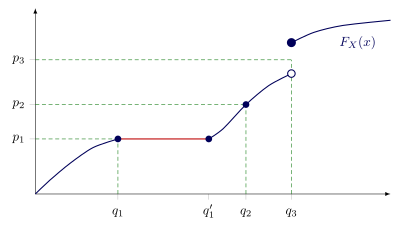

# Universal Transformations and Inverse-Transform Sampling

The previous chapter assembled the objects that describe a distribution — the
CDF, the density, the survival function, the hazard, and the cumulative hazard —
and worked out how they determine one another. Two of those objects do something
the others do not: they transform an arbitrary continuous distribution into a
fixed, universal one that does not depend on which distribution we started from.

The first is the CDF. The Probability Integral Transform says that $`F_X(X)`$ is
distributed as $`\text{Uniform}(0,1)`$, whatever $`X`$ was. The second is the
cumulative hazard. The Time-Rescaling theorem says that $`H_X(X)`$ is
distributed as $`\text{Exponential}(1)`$, again regardless of $`X`$. Each
transform carries $`X`$ onto a scale of its own — $`F_X`$ onto a probability
scale, $`H_X`$ onto a risk-time scale.

If $`F_X`$ carries $`X`$ to a uniformly distributed random variable, then some
inverse should carry a uniformly distributed random variable back to $`X`$ — and
that inverse is a recipe for sampling: draw from the simple uniform
distribution, apply the inverse, and obtain a draw from $`P_X`$. This chapter
develops that inverse on both scales. On the probability scale the inverse is
the *quantile function* $`Q_X`$, which we define carefully, because $`F_X`$ need
not be invertible in the ordinary function-inverse sense. On the risk-time
scale the inverse is the inverse cumulative hazard, which we obtain from $`Q_X`$
at no extra cost, since the two scales differ only by the fixed relabeling
$`u \mapsto -\log(1-u)`$.

For strictly increasing continuous distributions, the quantile function $`Q_X`$
is very simple: it's just the usual function inverse of $`F_X`$. If all of your
distributions are this nice, you can safely skip over the technical material of
"The Quantile Function" section and mentally substitute $`F_X^{-1}`$ whenever
you read $`Q_X`$.

## The Quantile Function

The CDF $`F_X`$ answers the question "given a level $`x`$, what fraction of the
population has $`X \le x`$?" Often we want the reverse: "given a fraction $`p`$,
what level $`x`$ sits at that fraction?" This is the quantile: the median is the
level at $`p = 1/2`$, the 90th percentile is the level at $`p = 0.9`$, and so
on. When $`F_X`$ is continuous and strictly increasing, the reverse question has
a unique answer and the quantile is just $`F_X^{-1}(p)`$, the function inverse
of the CDF. But $`F_X`$ need not be invertible in general: it can be flat (a
range of levels sharing the same fraction) or it can jump (a fraction attained
at no level at all). The *quantile function* extends the inverse to every
$`F_X`$, agreeing with $`F_X^{-1}`$ when it exists uniquely and supplying a
definite answer when it does not.

**Def:** The *quantile function* of an r.v. $`X : \Omega \to \mathbb{R}`$ is the function $`Q_X : (0,1) \to \mathbb{R}`$ defined by
```math
Q_X(p) := \inf\{x \in \mathbb{R} : F_X(x) \ge p\}.
```

**Notation:** As with the CDF, we drop the subscript when the r.v. is clear from
context: $`Q(p) := Q_X(p)`$. Also, the quantile function is sometimes referred
to informally as "the inverse CDF," even though strictly speaking the CDF may
not have a function inverse, because the quantile "acts like" the function
inverse in an important way we will soon make precise.

Observe that $`Q_X(p)`$ is well defined: for each $`p \in (0,1)`$ the set $`\{x : F_X(x) \ge p\}`$ is nonempty because $`F_X(x) \to 1`$ as $`x \to \infty`$, and bounded below because $`F_X(x) \to 0`$ as $`x \to -\infty`$ — both defining limits of a CDF — and so the $`\inf\{x : F_X(x) \ge p\}`$ always exists.

### The relationship between $`F_X`$, $`F_X^{-1}`$, and $`Q_X`$ illustrated



We can understand the relationship between $`F_X`$, $`F_X^{-1}`$, and $`Q_X`$ by thinking through what each tells us for different regions in the plot above. For a level $`p`$ on the y-axis, the preimage $`F_X^{-1}(p)`$ properly denotes the set
```math
F_X^{-1}(p) = \{x \in \mathbb{R} : F_X(x) = p\}.
```

The three levels marked in the figure show the three ways the preimage and the quantile can relate, according to the local behavior of $`F_X`$. Observe from the graph that we have

| $`y`$-value | Inverse Image | Feature of the graph |
|----|-----|----
| $`p_1`$ | $`F_X^{-1}(p_1) = [q_1, q_1']`$ | $`F_X`$ is constant ("flat") on $`[q_1, q_1']`$. |
| $`p_2`$ | $`F_X^{-1}(p_2) = \{q_2\}`$ | $`F_X`$ is strictly increasing near $`p_2`$.<br>$`F_X`$ is invertible near $`p_2`$. |
| $`p_3`$ | $`F_X^{-1}(p_3) = \varnothing`$ | $`p_3 < F_X(q_3)`$, so<br>$`q_3 \in \{x \in \mathbb{R} : F_X(x) \ge p_3\}`$. |

The $`\inf`$ in the definition of $`Q_X`$ provides a consistent way of dealing with the two problem cases: a point where $`F_X`$ is locally constant and a point at which $`F_X`$ has a jump discontinuity. Observe again from the graph that we have:

| $`y`$-value | Inverse Image | How the rule chooses a value |
|----|-----|----
| $`p_1`$ | $`Q_X(p_1) = q_1`$ | The $`\inf`$ gives us the left endpoint of the<br>preimage $`F_X^{-1}(p_1)`$. |
| $`p_2`$ | $`Q_X(p_2) = q_2`$ | Always agree with the function inverse<br>when it exists. |
| $`p_3`$ | $`Q_X(p_3) = q_3`$ | The smallest $`x`$ for which $`F_X(x) \ge p_3`$,<br>which always exists. |

In the simple case that $`F_X`$ is continuous and strictly increasing everywhere, $`Q_X`$ is just the function inverse.

### The Galois equivalence

Every property of the quantile function we need follows from a single simple equivalence relating $`Q_X`$ and $`F_X`$. We state and prove it first, then derive everything else from it.

**Theorem (Galois equivalence):** For all $`p \in (0,1)`$ and all $`x \in \mathbb{R}`$,
```math
Q_X(p) \le x \quad\Longleftrightarrow\quad p \le F_X(x).
```

**Proof:** Write $`A_p := \{y \in \mathbb{R} : F_X(y) \ge p\}`$, so that $`Q_X(p) = \inf A_p`$.

($`\Leftarrow`$) Suppose $`p \le F_X(x)`$. Then $`x \in A_p`$, and since $`Q_X(p) = \inf A_p`$ is a lower bound for $`A_p`$, we have $`Q_X(p) \le x`$.

($`\Rightarrow`$) Suppose $`Q_X(p) \le x`$. Right-continuity of $`F_X`$ ensures the infimum defining $`Q_X(p)`$ is attained, so $`Q_X(p) \in A_p`$, that is, $`F_X(Q_X(p)) \ge p`$. Applying the nondecreasing function $`F_X`$ to both sides of $`Q_X(p) \le x`$ preserves the inequality, giving

```math
p \le F_X(Q_X(p)) \le F_X(x),
```

so $`p \le F_X(x)`$, as required. $`\quad\blacksquare`$

### Consequences of the equivalence

The Galois equivalence lets us convert statements about $`Q_X`$ into statements about $`F_X`$ and back. The properties below are its immediate consequences.

**Proposition (monotonicity):** $`Q_X`$ is nondecreasing on $`(0,1)`$.

**Proof:** Let $`p_1 \le p_2`$ in $`(0,1)`$. Set $`x := Q_X(p_2)`$. Applying the equivalence to $`p_2`$ and this $`x`$, the statement $`Q_X(p_2) \le x`$ is true (it is equality), so $`p_2 \le F_X(x)`$. Since $`p_1 \le p_2`$, transitivity gives $`p_1 \le F_X(x)`$. Applying the equivalence in the other direction, now to $`p_1`$ and $`x`$, from $`p_1 \le F_X(x)`$ we conclude $`Q_X(p_1) \le x = Q_X(p_2)`$. $`\quad\blacksquare`$

**Proposition (the two near-inverse relations):** For all $`p \in (0,1)`$, and for all $`x`$ with $`F_X(x) \in (0,1)`$,

1. $`F_X(Q_X(p)) \ge p`$, with equality when $`F_X`$ is continuous at $`Q_X(p)`$;
2. $`Q_X(F_X(x)) \le x`$, with equality when $`F_X(x') < F_X(x)`$ for every $`x' < x`$.

**Note:** Equality in near-inverse relation (1) requires only left-continuity of $`F_X`$ at $`Q_X(p)`$; the inequality itself already follows from the right-continuity built into the definition of a CDF. The condition for equality in near-inverse relation (2) is that $`F_X`$ is strictly increasing to the left of $`x`$.

**Proof:** For near-inverse relation (1), the inequality was established inside the proof of the equivalence, where we showed $`Q_X(p) \in A_p`$, i.e. $`F_X(Q_X(p)) \ge p`$. For the equality condition, suppose $`F_X`$ is continuous at $`q := Q_X(p)`$. Every $`z < q`$ lies strictly below the infimum defining $`Q_X(p)`$, so $`z \notin A_p`$ and hence $`F_X(z) < p`$. Letting $`z \to q^-`$ ($`z`$ increases to $`q`$ from below) and using left-continuity of $`F_X`$ at $`q`$ (part of continuity there),
```math
F_X(q) = \lim_{z \to q^-} F_X(z) \le p.
```
Combined with $`F_X(q) \ge p`$ from the inequality, this gives $`F_X(Q_X(p)) = p`$.

For near-inverse relation (2), abbreviate $`p := F_X(x)`$, and note $`p \in (0,1)`$ so that $`Q_X(p)`$ is defined. Then $`p \le F_X(x)`$ holds trivially, being equality. Applying the equivalence to this $`p`$ and this $`x`$, from $`p \le F_X(x)`$ we conclude $`Q_X(p) \le x`$, that is, $`Q_X(F_X(x)) \le x`$. For the equality condition, suppose $`F_X(x') < F_X(x)`$ for every $`x' < x`$. Then no $`x' < x`$ satisfies $`F_X(x') \ge F_X(x) = p`$, so every element of $`A_p = \{y : F_X(y) \ge p\}`$ is at least $`x`$, whence $`Q_X(p) = \inf A_p \ge x`$. Together with $`Q_X(p) \le x`$ this gives $`Q_X(F_X(x)) = x`$. $`\quad\blacksquare`$


### Almost Sure Inversion

Equality in near-inverse relation (1) holds when $`F_X`$ is continuous; equality in near-inverse relation (2) holds when $`F_X`$ is strictly increasing. When $`F_X`$ is both, $`Q_X`$ is the ordinary two-sided inverse function. For a continuous $`F_X`$, it turns out that the set of all points at which $`Q_X \circ F_X`$ is *not* the identity function is a $`P_X`$-null set. In other words, $`Q_X`$ inverts $`F_X`$ almost surely, that is, with probability 1.

**Theorem:** Suppose $`F_X`$ is continuous. Then
```math
D := \{x \in \mathbb{R} : Q_X(F_X(x)) < x\}
```
is a $`P_X`$-null set, i.e. $`P_X(D) = 0`$.

**Proof:** By near-inverse relation (2), $`Q_X(F_X(x)) \le x`$ for every $`x`$, so $`D`$ is exactly the set of points where this inequality is strict. Fix $`x \in D`$ and write $`x_\ell := Q_X(F_X(x))`$, so that $`x_\ell < x`$.

Let $`c := F_X(x)`$ and consider the set $`\{y \in \mathbb{R} : F_X(y) = c\}`$ on which $`F_X`$ is constant equal to $`c`$. This set is an interval: if $`a`$ and $`b`$ both lie in it with $`a < b`$, then for any $`y`$ with $`a \le y \le b`$, monotonicity of $`F_X`$ gives
```math
c = F_X(a) \le F_X(y) \le F_X(b) = c,
```
so $`F_X(y) = c`$ and $`y`$ lies in the set as well. Its left endpoint is $`x_\ell`$: by near-inverse relation (1) with $`p := c`$ and continuity of $`F_X`$ (which forces equality in near-inverse relation (1)), we have $`F_X(x_\ell) = F_X(Q_X(c)) = c`$, and $`x_\ell = Q_X(c)`$ is by definition the least level at which $`F_X`$ reaches $`c`$. Let $`x'`$ be its right endpoint. Continuity of $`F_X`$ gives $`F_X(x') = c`$, so the interval contains its right endpoint and equals $`[x_\ell, x']`$, with $`x_\ell < x \le x'`$.

The left endpoint does not belong to $`D`$: since $`F_X(x_\ell) = c = F_X(x)`$, we have $`Q_X(F_X(x_\ell)) = Q_X(c) = x_\ell`$, so near-inverse relation (2) holds with equality at $`x_\ell`$. Hence every point of $`D`$ at which $`F_X`$ equals $`c`$ lies in the half-open interval $`(x_\ell, x']`$, which carries probability
```math
P_X\big((x_\ell, x']\big) = F_X(x') - F_X(x_\ell) = c - c = 0.
```

As $`x`$ ranges over $`D`$, the value $`c = F_X(x)`$ determines the interval $`(x_\ell, x']`$, and distinct values of $`c`$ give disjoint intervals. In other words, $`D`$ is covered by disjoint $`P_X`$-null intervals. Let $`\mathcal{I}`$ be the collection of these intervals. Each has positive length, since $`x_\ell < x'`$, so $`\mathcal{I}`$ is at most countable, as any collection of disjoint positive-length intervals of $`\mathbb{R}`$ is countable. Since $`D \subseteq \bigcup_{I \in \mathcal{I}}`$, countable additivity gives
```math
P_X(D) = \sum_{I \in \mathcal{I}} P_X(I) = 0.\quad\blacksquare
```

### Left-continuity

$`F_X`$ is right-continuous by convention and $`Q_X`$ is left-continuous as a consequence.

**Proposition (left-continuity):** $`Q_X`$ is left-continuous on $`(0,1)`$: for every $`p \in (0,1)`$, $`\lim_{q \to p^-} Q_X(q) = Q_X(p)`$.

**Proof:** Since $`Q_X`$ is nondecreasing, the left-hand limit $`L := \lim_{q \to p^-} Q_X(q)`$ exists and satisfies $`L \le Q_X(p)`$, being the supremum of the values $`Q_X(q)`$ over $`q < p`$. We show the reverse inequality $`L \ge Q_X(p)`$, which forces $`L = Q_X(p)`$.

Take any sequence $`q_n \uparrow p`$ with $`q_n \in (0,1)`$ and $`q_n < p`$. By near-inverse relation (1), $`F_X(Q_X(q_n)) \ge q_n`$ for each $`n`$. Since $`Q_X(q_n) \le L`$ (as $`L`$ is the supremum of these values) and $`F_X`$ is nondecreasing,
```math
F_X(L) \ge F_X(Q_X(q_n)) \ge q_n.
```
Letting $`n \to \infty`$, the right side tends to $`p`$, and the inequality is preserved in the limit, giving $`F_X(L) \ge p`$. By the Galois equivalence applied to the level $`p`$ and the point $`L`$, from $`p \le F_X(L)`$ we conclude $`Q_X(p) \le L`$. Combined with $`L \le Q_X(p)`$, this gives $`L = Q_X(p)`$. $`\quad\blacksquare`$

## The Probability Integral Transform for the CDF

For an r.v. $`X`$ with continuous distribution $`F_X`$, the r.v. defined by
$`U := F_X(X)`$ can be interpreted as giving the *percentile rank* of the
outcome. The map $`F_X`$ in a sense "flattens out" $`X`$. The r.v. $`U`$ is
guaranteed to be uniformly distributed on $`(0,1)`$.

**Theorem (The Probability Integral Transform).** Let $`X`$ be an r.v. with
continuous cumulative distribution $`F_X`$. Then the r.v. $`U := F_X(X)`$ is
uniformly distributed on $`(0,1)`$.

**Proof.** Fix $`u \in (0,1)`$. Negating the Galois equivalence at the level
$`u`$ and the point $`X(\omega)`$ turns $`Q_X(u) \le X \iff u \le F_X(X)`$ into
the exact event identity
```math
\{F_X(X) < u\} = \{X < Q_X(u)\}.
```
Taking probabilities and using that a continuous $`F_X`$ has no atoms (so
$`P(X < a) = F_X(a)`$) together with $`F_X(Q_X(u)) = u`$ (near-inverse
relation (1), with equality since $`F_X`$ is continuous),
```math
P(F_X(X) < u) = P(X < Q_X(u)) = F_X(Q_X(u)) = u.
```
This holds for every $`u \in (0,1)`$, so $`U = F_X(X)`$ has CDF $`F_U(u) = u`$
on $`(0,1)`$, which is the $`\text{Uniform}(0,1)`$ distribution.
$`\quad\blacksquare`$

**Interpretation:** Every continuous random variable, no matter how lumpy or
skewed its distribution, is the uniform distribution in disguise. Applying
$`F_X`$ to $`X`$ strips away all the distributional shape and leaves behind
featureless uniform randomness on $`(0,1)`$.

The Probability Integral Transform pushes a random variable forward through
its own CDF and produces a uniformly distributed random variable. The converse
runs the arrow backward: it feeds a uniformly distributed random variable into
the quantile function and recovers the original distribution. Unlike the forward
PIT, this direction works for any $`F_X`$, even for an $`F_X`$ that is not
continuous or strictly increasing.

**Theorem (Converse of the PIT).** Let $`F_X`$ be any CDF with quantile
function $`Q_X`$, and let $`U \sim \text{Uniform}(0,1)`$. Then $`Q_X(U)`$ has
CDF $`F_X`$; that is, $`Q_X(U) \sim P_X`$.

**Proof.** Since $`U \in (0,1)`$ with probability one, $`Q_X(U)`$ is defined
almost surely. Fix $`x \in \mathbb{R}`$. The Galois equivalence, applied at the
level $`U(\omega)`$ and the point $`x`$, gives the exact event identity
```math
\{Q_X(U) \le x\} = \{U \le F_X(x)\}.
```
Taking probabilities and using that $`F_X(x) \in [0,1]`$ with $`U`$ uniform, so
that $`P(U \le F_X(x)) = F_X(x)`$,
```math
P(Q_X(U) \le x) = P(U \le F_X(x)) = F_X(x).
```
Since $`x`$ was arbitrary, $`Q_X(U)`$ has CDF $`F_X`$. $`\quad\blacksquare`$

## Time-Rescaling by the Cumulative Hazard

The CDF turns any continuous random variable into a uniformly distributed one.
The cumulative hazard turns any lifetime into a unit-exponentially distributed
one: rescale time by $`H_X`$ and the rescaled event happens at rate 1.

**Theorem:** Let $`F_X`$ be a continuous CDF for an r.v. $`X`$. Then the r.v.
$`Y := H_X(X)`$ is exponentially distributed with rate $`1`$.

**Proof:** Since $`X`$ is continuous,
- $`F_X`$ is continuous nondecreasing
- $`S_X = 1 - F_X`$ is continuous nonincreasing
- $`H_X = -\log S_X`$ is continuous and nondecreasing, mapping the support of
  $`X`$ onto $`[0,\infty)`$.

The survival function of $`Y`$ is
```math
S_Y(y) = P(Y > y) = P(H_X(X) > y) = P(-\log S_X(X) > y) = P(S_X(X) < e^{-y}).
```

By the previous Probability Integral Transform theorem, $`F_X(X)`$ is uniform on
$`(0,1)`$, and so $`S_X(X) = 1 - F_X(X)`$ is also uniform on $`(0,1)`$. So for
$`e^{-y} \in (0,1]`$,
```math
P(S_X(X) < e^{-y}) = e^{-y}.
```

This shows that $`S_Y(y) = e^{-y}`$, that is, that $`F_Y(y) = 1 - e^{-y}`$.
$`\quad\blacksquare`$

**Interpretation:** The Probability Integral Transform and the Time-Rescaling
theorem are really two ways of reporting the same underlying result. The
cumulative hazard is itself just a transformation of the CDF: since
$`H_X = -\log(1 - F_X)`$, it is $`F_X`$ followed by the fixed relabeling
$`u \mapsto -\log(1-u)`$. Push the uniform $`U = F_X(X)`$ through that
relabeling and out comes the unit exponential $`Y = H_X(X)`$. Underneath every
continuous random variable sits the same featureless single object, and $`F_X`$
and $`H_X`$ are two coordinate systems for reading it off: $`F_X`$ reports a
rank, the percentile, uniform on $`(0,1)`$; $`H_X`$ reports an accumulated
hazard, the risk-clock, exponential with rate 1.

Time-Rescaling pushes a random variable forward through its cumulative hazard
and produces a rate-1 exponential. The converse runs the arrow backward: it
feeds a rate-1 exponential into the inverse cumulative hazard and recovers the
original distribution.

The inverse cumulative hazard is the risk-time analog of the quantile function,
and we get it from $`Q_X`$ at no extra cost. Since $`H_X = -\log(1 - F_X)`$
relabels the probability scale onto the risk-time scale by
$`u \mapsto -\log(1-u)`$, its inverse relabels back by $`y \mapsto 1 - e^{-y}`$,
applied before the quantile function.

**Def:** The *inverse cumulative hazard* of an r.v. $`X`$ is
```math
H_X^{-1}(y) := Q_X\big(1 - e^{-y}\big), \qquad y > 0.
```

**Theorem (Converse of Time-Rescaling).** Let $`F_X`$ be any CDF, with inverse
cumulative hazard $`H_X^{-1}`$, and let $`Y \sim \text{Exponential}(1)`$. Then
$`H_X^{-1}(Y)`$ has CDF $`F_X`$; that is, $`H_X^{-1}(Y) \sim P_X`$.

**Proof.** Set $`U := 1 - e^{-Y}`$. For $`u \in (0,1)`$,
```math
P(U \le u) = P\big(1 - e^{-Y} \le u\big) = P\big(Y \le -\log(1-u)\big) = 1 - e^{-(-\log(1-u))} = u,
```
so $`U \sim \text{Uniform}(0,1)`$. (This is the forward PIT applied to $`Y`$
itself: $`U = F_{\text{Exp}(1)}(Y)`$, and the unit-exponential CDF is
continuous.) By the converse of the PIT,
```math
H_X^{-1}(Y) = Q_X\big(1 - e^{-Y}\big) = Q_X(U) \sim P_X. \quad\blacksquare
```

**Note:** Like the converse of the PIT, this direction needs no hypothesis on
$`F_X`$: the forward Time-Rescaling theorem requires $`F_X`$ continuous because
it invokes the forward PIT internally, whereas the backward direction inherits
the converse PIT's freedom from any hypothesis. The proof also shows this
converse to be the converse of the PIT precomposed with the relabeling
$`y \mapsto 1 - e^{-y}`$, the inverse of the forward relabeling
$`u \mapsto -\log(1-u)`$ and itself the forward PIT for the unit exponential.

## Inverse-Transform Sampling

The converse theorems of the previous sections say that we can transform a
standard reference distribution into any given distribution $`P_X`$. This gives
us a recipe for drawing sampled values from any given distribution $`P_X`$ as
long as we have a way of sampling from the standard reference distribution, by
pushing the draw backward through an inverse. This is called *inverse-transform
sampling*. The two converses give the method on the two scales.

### Sampling on the probability scale

The Converse of the Probability Integral Transform supplies the first method:
for $`p \sim \text{Uniform}(0,1)`$, the value $`Q_X(p)`$ has distribution
$`P_X`$. Read as a procedure, we draw $`p \sim \text{Uniform}(0,1)`$ and return
x := Q_X(p). We have already done all the mathematical work to prove this works.
The theorem guarantees $`x \sim P_X`$ with no additional hypothesis on $`F_X`$.
It may be constant on some intervals, or have jump discontinuities, and the
quantile function still delivers the right distribution, because $`Q_X`$ was
built to invert $`F_X`$ at every level that carries probability.

When $`F_X`$ is continuous and strictly increasing, $`Q_X`$ is just the usual
function inverse $`F_X^{-1}`$ ,and the recipe is elementary: solve
$`F_X(x) = p`$ for $`x`$. For $`X \sim \text{Exponential}(\lambda)`$, with
$`F_X(x) = 1 - e^{-\lambda x}`$, this gives
```math
x = Q_X(p) = -\frac{1}{\lambda}\log(1 - p).
```
For rate $`\lambda = 1`$ the quantile is exactly $`-\log(1-p)`$, a fact we will
use in a moment.

**Interpretation:** This method of sampling $`X`$ is essentially, pick a
percentile rank $`p \sim \text{Uniform}(0,1)`$, then find the value $`x`$ that
achieves it. In the context of wait times, pick a fraction
$`p \sim \text{Uniform}(0,1)`$ of the population, then find the time by which
that fraction have had their event.

### Sampling on the risk-time scale

The Converse of Time-Rescaling supplies the second method: for
$`y \sim \text{Exponential}(1)`$, the value $`H_X^{-1}(y)`$ has distribution
$`P_X`$. Draw $`y \sim \text{Exponential}(1)`$ and return
```math
t := H_X^{-1}(y) = Q_X\big(1 - e^{-y}\big).
```
Again $`t \sim P_X`$ for any $`F_X`$. We write the returned value as $`t`$
because the main use of this scale is wait times, where a draw is an event time.

**Interpretation:** On the risk-time scale a lifetime accumulates hazard at unit
rate, so $`y`$ is the quantity of accumulated hazard at which the event fires,
and $`H_X^{-1}`$ converts that quantity of risk into the calendar time at which
the target's cumulative hazard first reaches it. So the interpretation of this
method of sampling $`X`$ is, pick a total-hazard value
$`y \sim \text{Exponential}(1)`$, then find the time when $`H_X`$ reaches it.

#### Using uniform sample for risk-time sampling

The two procedures draw from different references, but the rate one exponential
distribution is just an invertible transformation of the standard uniform
distribution. Feeding $`p \sim \text{Uniform}(0,1)`$ through
$`y := -\log(1 - p)`$ produces $`y \sim \text{Exponential}(1)`$; this is
inverse-transform sampling applied to the unit exponential itself, since
$`-\log(1-p)`$ is its quantile function. With this one map there is no need for
a separate exponential generator: draw a uniform, relabel, and proceed on the
risk-time scale.

The relabeling also shows the two methods return the same number, not merely the
same distribution. Substituting $`y = -\log(1-p)`$ into the risk-time recipe,
```math
H_X^{-1}(y) = Q_X\big(1 - e^{-y}\big) = Q_X\big(1 - e^{\log(1-p)}\big) = Q_X\big(1 - (1-p)\big) = Q_X(p).
```
The probability scale and the risk-time scale are two coordinate systems for the
same underlying uniform, and inverse-transform sampling on either lands on the
identical draw. For generating a single value these methods are equivalent.

#### Risk-time sampling is often more natural

If these sampling methods are equivalent, why would one ever use risk-time
sampling? The hazard function is the most natural primitive construct upon which
many models are built. As the treatment of the hazard emphasized, a wait-time
model is most naturally specified by stating the instantaneous risk faced by a
survivor, and the cumulative hazard is then one integration away. Sampling by
the inverse cumulative hazard draws from such a model in the terms in which it
was written. Reaching for the quantile function instead means first assembling
$`F_X`$ from the hazard and inverting that, a derived object standing a step
further from the specification.

Placing an event by the inverse cumulative hazard accumulates hazard forward
from the present until the running total reaches the drawn value, so the
computation looks only at the hazard between now and the event being placed.
Inverting the CDF works instead with $`F_X`$, a statement about the whole
elapsed history up to the event. When events are generated one after another,
and especially when the hazard may be revised as a simulation unfolds,
consulting only the hazard from the present forward is the more natural
bookkeeping. This locality rests on a property of the exponential we have not
yet established, memorylessness, which the next chapter takes up. One could
carry whatever global bookkeeping the CDF route requires and arrive at the same
samples; the inverse cumulative hazard makes that bookkeeping unnecessary.
